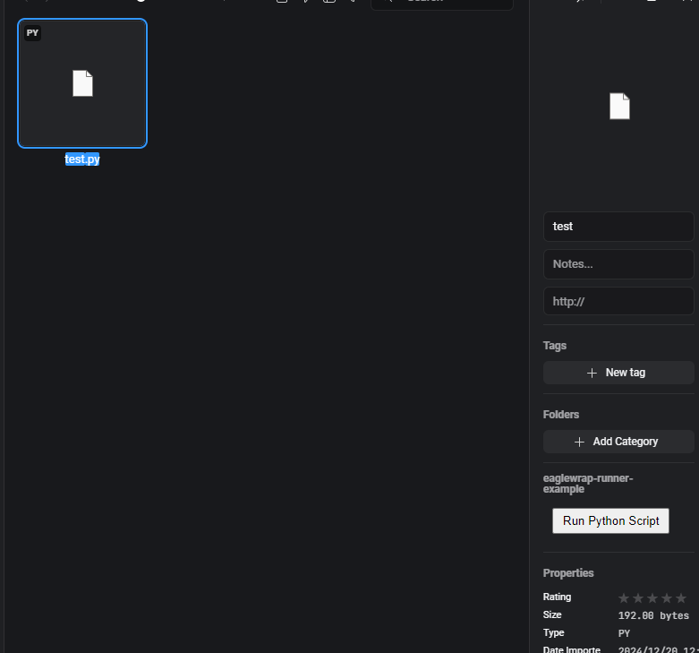
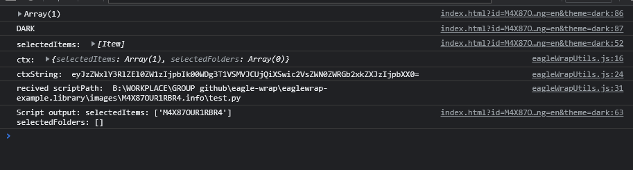

> deprecated, newest implementation TBD at https://github.com/orgs/eagle-cooler/repositories

# eagle-wrap
wrapper for eagle.cool

## Features
- [x] access settings in appdata
- [x] easier access api methods
- [x] allow briding to python code

## Installation
```bash
pip install eagle-wrap
```

## Usage
```bash
eaglewrap --help
```

to bridge a python file
```bash
eaglewrap script <python_file_path> <base64_encoded_ctx>
```

## Integrate with your eagle plugin
- simply copy the `latest (release)` eagleWrapUtils.js to your plugin folder
- in your html file, import the `eagleWrapUtils.js`
```html
<script src="eagleWrapUtils.js"></script>
```
- in your python file, you can optionally include this code to enable type hints and IDE support
```py
from eaglewrap.bridge import _applyCtx
ctx = _applyCtx()
```

## Example
- see [index.html](./eaglewrap-runner-example/index.html) for html implementation
- see [test.py](./eaglewrap-example.library/images/M4X87OUR1RBR4.info/test.py) for python implementation
- for better understanding, open library at [eaglewrap-example.library](./eaglewrap-example.library) and import extension at `eaglewrap-runner-example`

### Showcase


