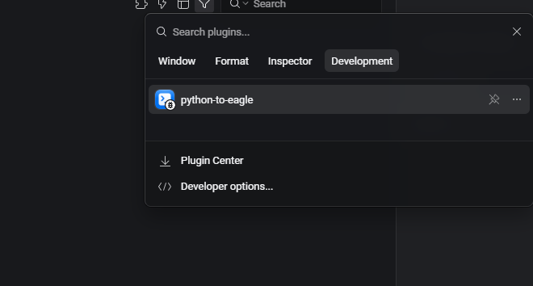
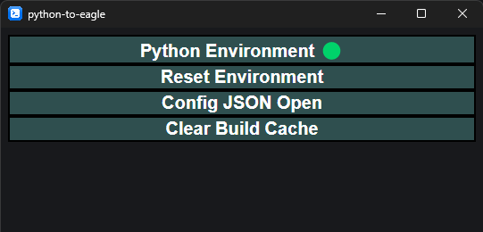
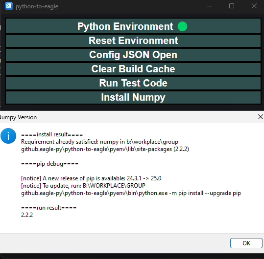

# Python to Eagle
This plugin brings the python environment to eagle

## Usage
1. install the plugin from release page
2. open the plugin at 

    

3. click `reset environment` to set it up

    

4. for testing, you can click `install numpy` to install numpy and print its version

    

